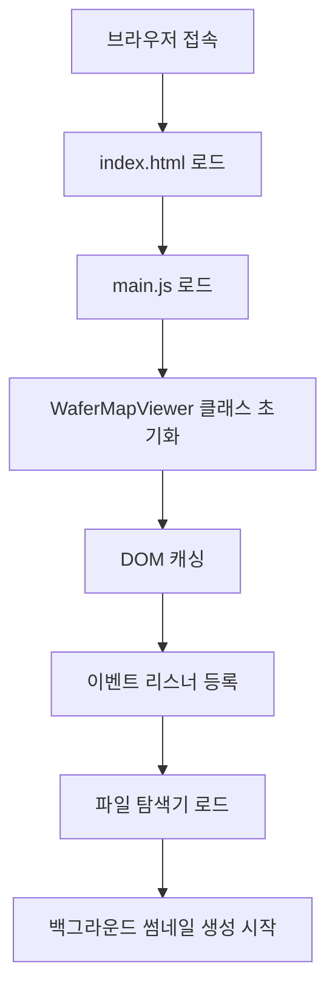
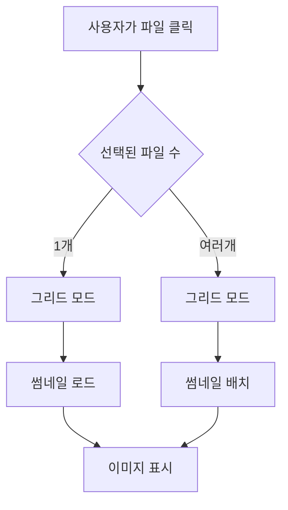
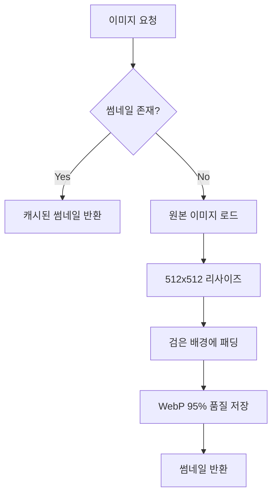

# Wafer Map Viewer - 프로젝트 구조 및 동작 설명

## 📁 프로젝트 구조

```
l3tracker/
├── 🖥️ 프론트엔드 (웹 인터페이스)
│   ├── index.html          # 메인 HTML 페이지 (UI 구조)
│   ├── main.js             # 메인 JavaScript (3500+ 줄, 모든 프론트엔드 로직)
│   └── frontend/
│       └── app.py          # Streamlit 대시보드 (선택적)
│
├── 🚀 백엔드 API
│   ├── api/
│   │   ├── main.py         # FastAPI 서버 (600+ 줄, 모든 API 엔드포인트)
│   │   ├── config.py       # 설정 파일 (경로, 썸네일 설정)
│   │   ├── model_utils.py  # 모델 유틸리티
│   │   └── utils.py        # 공통 유틸리티 함수
│
├── 📋 설정 및 문서
│   ├── requirements.txt    # Python 의존성
│   ├── README.md          # 프로젝트 설명
│   ├── ARCHITECTURE.md    # 이 파일 (구조 설명)
│   └── CHANGELOG.md       # 변경사항 기록
│
└── 📊 데이터 (외부 경로)
    └── D:/project/data/wm-811k/  # 웨이퍼 맵 이미지 데이터
```

## 🏗️ 시스템 아키텍처

### 1. **웹 기반 3계층 구조**
```
┌─────────────────┐    HTTP/WebSocket    ┌──────────────────┐    File I/O    ┌─────────────────┐
│   프론트엔드     │ ◄──────────────────► │    백엔드 API     │ ◄─────────────► │   파일 시스템    │
│   (브라우저)     │                      │   (FastAPI)      │                │ (이미지/썸네일)  │
└─────────────────┘                      └──────────────────┘                └─────────────────┘
```

### 2. **주요 컴포넌트**

#### 🎨 **프론트엔드 (index.html + main.js)**
- **단일 페이지 애플리케이션 (SPA)**
- **반응형 3패널 레이아웃**: 좌측 파일탐색기 | 중앙 이미지뷰어 | 우측 클래스관리
- **모드 전환**: 단일 이미지 모드 ↔ 그리드 모드
- **실시간 썸네일 로딩** 및 **지연 로딩 (Lazy Loading)**

#### ⚡ **백엔드 (FastAPI)**
- **RESTful API** 설계
- **비동기 처리** (async/await)
- **백그라운드 썸네일 생성** 시스템
- **파일 시스템 추상화**

## 🔄 주요 동작 흐름

### 1. **애플리케이션 시작**


### 2. **파일 선택 및 표시**


### 3. **썸네일 생성 시스템**


## 🧩 핵심 클래스 및 함수

### **JavaScript (main.js)**

#### **WaferMapViewer 클래스** (메인 컨트롤러)
```javascript
class WaferMapViewer {
    // 🏗️ 초기화
    constructor()               // DOM 캐싱, 상태 초기화, 이벤트 바인딩
    
    // 📁 파일 관리
    handleFileClick()           // 파일/폴더 클릭 처리
    loadDirectoryContents()     // 디렉터리 내용 로드
    
    // 🖼️ 이미지 표시
    showGrid()                  // 그리드 모드 표시
    loadImage()                 // 단일 이미지 로드
    
    // 🔍 검색 기능
    performSearch()             // 파일/폴더 검색
    searchInDirectory()         // 재귀적 디렉터리 검색
    
    // 🎯 선택 관리
    toggleGridImageSelect()     // 그리드 이미지 선택/해제
    updateGridSelection()       // 선택 상태 UI 업데이트
    
    // 📋 컨텍스트 메뉴
    showContextMenu()           // 우클릭 메뉴 표시
    mergeAndCopyImages()        // 이미지 합치기
    copyFileList()              // 파일 리스트 복사
    
    // 🏷️ 분류 관리
    addClass()                  // 클래스 추가
    refreshClassList()          // 클래스 목록 갱신
}
```

### **Python (api/main.py)**

#### **주요 API 엔드포인트**
```python
# 📁 파일 시스템
@app.get("/api/files")          # 디렉터리 내용 조회
@app.get("/api/image")          # 이미지 파일 반환

# 🖼️ 썸네일 관리
@app.get("/api/thumbnail")      # 썸네일 생성/반환
@app.post("/api/thumbnail/preload")  # 썸네일 미리 생성

# 🏷️ 분류 시스템
@app.get("/api/classes")        # 클래스 목록 조회
@app.post("/api/classes")       # 새 클래스 생성
@app.post("/api/classify")      # 이미지 분류

# 📊 시스템 상태
@app.get("/api/worker/stats")   # 워커 통계
@app.get("/api/background/stats") # 백그라운드 작업 통계
```

#### **백그라운드 썸네일 시스템**
```python
class BackgroundThumbnailManager:
    async def start()           # 백그라운드 시스템 시작
    async def _scan_and_generate()  # 주기적 스캔 및 생성
    def _create_thumbnail_safe()    # 안전한 썸네일 생성
```

## 🎛️ 주요 기능별 동작

### **1. 파일 탐색 및 선택**
- **계층적 폴더 구조** 표시
- **Ctrl+클릭**: 다중 선택
- **Shift+클릭**: 범위 선택
- **지연 로딩**: 필요할 때만 하위 폴더 로드

### **2. 이미지 표시 모드**
- **그리드 모드**: 여러 이미지를 격자로 표시
- **단일 이미지 모드**: 한 이미지를 크게 표시 (확대/축소/팬)
- **자동 모드 전환**: 선택 개수에 따라 자동 전환

### **3. 검색 시스템**
- **폴더명 검색**: 폴더 이름으로 필터링
- **파일명 검색**: 파일 이름으로 필터링
- **조합 검색**: 폴더+파일 동시 검색
- **재귀 검색**: 하위 폴더까지 모두 검색

### **4. 썸네일 최적화**
- **고품질**: 512x512, WebP 95% 품질
- **비율 유지**: 검은 배경에 중앙 정렬 패딩
- **백그라운드 생성**: 사용자 작업 방해 없이 생성
- **캐싱**: 한 번 생성된 썸네일 재사용

### **5. 컨텍스트 메뉴 시스템**
- **스마트 선택**: 우클릭 시 자동으로 해당 항목 선택
- **다중 다운로드**: 선택된 파일들 순차 다운로드
- **이미지 합치기**: N개 → √N x √N 그리드로 합치기
- **클립보드 연동**: 이미지/텍스트 클립보드 복사

## ⚡ 성능 최적화

### **프론트엔드**
- **가상화**: 대량 이미지 처리 시 메모리 효율성
- **디바운싱**: 검색/스크롤 이벤트 최적화
- **지연 로딩**: 화면에 보이는 썸네일만 로드
- **캔버스 기반**: 이미지 렌더링 성능 향상

### **백엔드**
- **비동기 처리**: 동시 요청 처리
- **스레드 풀**: 썸네일 생성 병렬화
- **백그라운드 작업**: 사용자 경험 방해 없이 처리
- **캐싱**: 파일 시스템 및 썸네일 캐시

## 🔧 설정 및 확장성

### **설정 파일 (config.py)**
```python
ROOT_DIR = "D:/project/data/wm-811k"  # 데이터 경로
THUMBNAIL_SIZE = (512, 512)           # 썸네일 크기
THUMBNAIL_QUALITY = 95                # 썸네일 품질
BACKGROUND_BATCH_SIZE = 10            # 백그라운드 배치 크기
```

### **확장 포인트**
- **새로운 이미지 형식**: `SUPPORTED_EXTS`에 추가
- **새로운 API**: `main.py`에 엔드포인트 추가
- **UI 컴포넌트**: `main.js`에 클래스/메서드 추가
- **분류 시스템**: 라벨링 및 ML 모델 연동 가능

이 구조를 통해 **확장 가능하고 유지보수가 용이한** 웨이퍼 맵 뷰어 시스템을 구현했습니다.

---

## 🔧 상세 구현 정보 및 수정 가이드

### **1. 고급 검색 시스템 (main.js)**

#### **구현 위치**: 991-1107번째 줄
- `fastFileNameSearch()`: DOM 기반 빠른 검색
- `matchesSearchQuery()`: 복합 표현식 파싱
- `evaluateExpression()`: 괄호 처리 및 연산자 우선순위
- `evaluateAndExpression()`, `evaluateNotExpression()`: AND/NOT 로직

#### **지원하는 연산자**:
```javascript
// 우선순위: () > NOT > AND > OR
"(center or donut) and not ring"
"edge and ring"
"not adaptive"
"center or donut"
```

#### **수정 방법**:
- **새 연산자 추가**: `evaluateExpression()` 함수에 새로운 분기 추가
- **검색 속도 조정**: `fastFileNameSearch()`의 DOM 쿼리 최적화

### **2. 컨텍스트 메뉴 시스템 (index.html + main.js)**

#### **HTML 구조** (787-804번째 줄):
```html
<div id="grid-context-menu" class="context-menu">
    <div class="context-menu-item" id="context-download">📥 선택 파일 다운로드</div>
    <div class="context-menu-item" id="context-merge-copy">🖼️ 이미지 합쳐서 클립보드 복사</div>
    <div class="context-menu-item" id="context-list-copy">📋 파일 리스트 복사</div>
    <div class="context-menu-item" id="context-table-copy">📊 파일리스트테이블복사</div>
    <div class="context-menu-item" id="context-cancel">❌ 취소</div>
</div>
```

#### **JavaScript 이벤트** (1216-1249번째 줄):
```javascript
initializeContextMenu() {
    // 각 메뉴 항목에 onclick 이벤트 연결
    const tableCopyItem = document.getElementById('context-table-copy');
    if (tableCopyItem) {
        tableCopyItem.onclick = () => {
            this.hideContextMenu();
            this.copyFileListAsTable();  // ← 핵심 함수 호출
        };
    }
}
```

### **3. 파일리스트 테이블 복사 기능 (main.js)**

#### **핵심 함수**: `copyFileListAsTable()` (1365-1428번째 줄)

#### **🎯 컬럼명 수정 위치**:
```javascript
// 📍 1398번째 줄 - 여기서 헤더명 변경!
const headers = ['Folder', 'Name_Part1', 'Name_Part2', 'Name_Part3', 'Name_Part4', 'Name_Part5'];

// 예시 변경:
const headers = ['폴더', '타입', '번호', '처리방법', '버전', '기타'];
const headers = ['Directory', 'WaferType', 'ProcessStep', 'Parameter', 'Version', 'Extra'];
```

#### **🎯 데이터 구조 수정 위치**:
```javascript
// 📍 1387-1394번째 줄 - 여기서 필드명 변경!
return {
    folder: folder || 'ROOT',
    part1: nameParts[0] || '',    // ← 변경 가능
    part2: nameParts[1] || '',    // ← 변경 가능
    part3: nameParts[2] || '',    // ← 변경 가능
    part4: nameParts[3] || '',    // ← 변경 가능
    part5: nameParts[4] || ''     // ← 변경 가능
};
```

#### **🎯 매핑 배열 수정 위치**:
```javascript
// 📍 1402번째 줄 - 위의 필드명과 일치시켜야 함!
const values = [row.folder, row.part1, row.part2, row.part3, row.part4, row.part5];
```

#### **파일명 분할 로직**:
```javascript
// 확장자 제거: fileName.replace(/\.[^/.]+$/, '')
// 언더스코어 분할: nameWithoutExt.split('_')
// 폴더명 추출: pathParts[pathParts.length - 2]
```

### **4. 폴더 숨기기 기능 (api/main.py)**

#### **구현 위치**: 495-497번째 줄
```python
# classification, thumbnails 폴더는 파일 탐색기에서 숨기기
if entry.name in ['classification', 'thumbnails']:
    continue
```

#### **수정 방법**:
```python
# 더 많은 폴더 숨기기
if entry.name in ['classification', 'thumbnails', '.git', 'temp', 'cache']:
    continue

# 패턴 기반 숨기기
if entry.name.startswith('.') or entry.name.endswith('_backup'):
    continue
```

### **5. 썸네일 시스템 설정 (api/config.py)**

#### **주요 설정값**:
```python
THUMBNAIL_SIZE = (512, 512)           # 썸네일 크기
THUMBNAIL_QUALITY = 95                # WebP 품질 (1-100)
BACKGROUND_BATCH_SIZE = 10            # 백그라운드 배치 크기
THUMBNAIL_CACHE_SECONDS = 86400       # 캐시 유지 시간
```

#### **성능 조정 방법**:
- **속도 우선**: `THUMBNAIL_SIZE = (256, 256)`, `THUMBNAIL_QUALITY = 80`
- **품질 우선**: `THUMBNAIL_SIZE = (1024, 1024)`, `THUMBNAIL_QUALITY = 100`
- **메모리 절약**: `BACKGROUND_BATCH_SIZE = 5`

### **6. UI 프레임 크기 조정 (index.html)**

#### **좌측 프레임** (47-50번째 줄):
```css
.sidebar {
    width: 400px;        /* ← 메인 너비 */
    min-width: 300px;    /* ← 최소 너비 */
    max-width: 600px;    /* ← 최대 너비 */
}
```

#### **우측 프레임** (434-437번째 줄):
```css
.wrapper-right {
    width: 390px;        /* ← 메인 너비 */
    min-width: 270px;    /* ← 최소 너비 */
    max-width: 540px;    /* ← 최대 너비 */
}
```

### **7. 검색 입력창 설정 (index.html)**

#### **검색창 크기 및 placeholder** (717번째 줄):
```html
<input type="text" id="file-search" 
       placeholder="파일명 입력 (예: (center or donut) and not ring)" 
       style="width: 320px;">
```

#### **수정 예시**:
```html
<!-- 더 넓은 검색창 -->
<input style="width: 400px;">

<!-- 다른 placeholder -->
placeholder="검색어 입력 (AND/OR/NOT/괄호 지원)"
```

### **8. 파일 선택 동작 로직 (main.js)**

#### **단일 클릭 vs 다중 선택** (1537-1550번째 줄):
```javascript
} else {
    // 단일 클릭 - 이미지 파일이면 자세히보기 모드
    this.selectedImages = [path];
    this.selectedImagePath = path;
    
    // 이미지 파일인지 확인
    if (this.isImageFile(path)) {
        // 자세히보기 모드로 전환
        this.hideGrid();
        this.loadImage(path);
    } else {
        // 이미지가 아니면 그리드 모드
        this.showGrid(this.selectedImages);
    }
}
```

#### **동작 변경 방법**:
```javascript
// 항상 그리드 모드로 하려면:
this.showGrid(this.selectedImages);

// 항상 자세히보기 모드로 하려면:
this.hideGrid();
this.loadImage(path);
```

### **9. 확장 포인트 및 개선 방향**

#### **새로운 컨텍스트 메뉴 항목 추가**:
1. **HTML**: `index.html`에 새 `context-menu-item` 추가
2. **JavaScript**: `initializeContextMenu()`에 이벤트 리스너 추가
3. **기능 구현**: 새로운 메서드 구현

#### **새로운 검색 연산자 추가**:
1. `matchesSearchQuery()`에 새 연산자 감지 로직 추가
2. 해당 연산자 처리 함수 구현
3. 우선순위 조정

#### **새로운 파일 형식 지원**:
1. `isImageFile()` 함수에 확장자 추가
2. `api/config.py`의 `SUPPORTED_EXTS` 업데이트

#### **성능 최적화**:
1. **가상화**: 대량 이미지 처리 시 가상 스크롤링 구현
2. **캐싱**: 브라우저 localStorage 활용
3. **지연 로딩**: Intersection Observer API 활용

이 가이드를 통해 GitHub에서 다운로드 후 빠르게 코드를 파악하고 개선할 수 있습니다.
